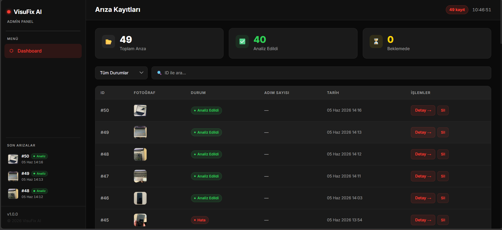
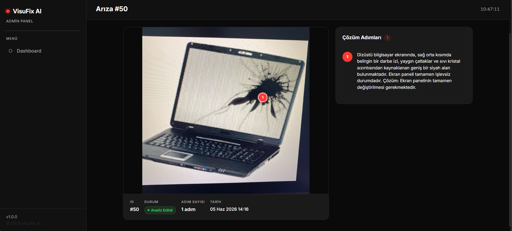

<p align="center">
  
  
  
  
  
  
</p>

# 🔧 VisuFix AI

**AI-powered visual fault detection and repair guide.**

VisuFix AI is an application that enables users to photograph their malfunctioning electronic devices (computer cases, modems, printers, etc.) and receive step-by-step repair guidance powered by artificial intelligence. Using Google Gemini Vision API, it automatically detects faults in the photograph and displays each fault point on screen with coordinate-based visual markers.

---

## 🎯 Problem & Motivation

When users attempt to repair their broken devices, the complexity of traditional static user manuals makes it difficult to find the correct steps, creating a risk of improper intervention. Since every device has a different structure, generic written instructions are often inadequate.

**VisuFix AI** solves this problem by providing a personalized, visual repair guide based on the **user's own photograph** of their device.

---

## ✨ Key Features

| Feature | Description |
|---------|-------------|
| 📸 **Photo-Based Fault Detection** | Analyzes device photos from camera or gallery using Gemini AI |
| 🎯 **Coordinate-Based Marking** | Pinpoints fault locations on the photo with precise coordinates |
| 🔴 **AR-Style Visual Markers** | Highlights fault points with pulse-animated markers |
| 📋 **Step-by-Step Repair Guide** | Provides detailed descriptions and solutions for each fault |
| 📱 **Mobile Application** | Cross-platform app built with React Native (Expo) |
| 🖥️ **Web Admin Panel** | Modern dashboard for managing all fault records |
| 🗄️ **RESTful API** | Full CRUD API built with Express.js |

---

## 📱 Mobile App Screenshots

<p align="center">
  
  &nbsp;&nbsp;
  
  &nbsp;&nbsp;
  
</p>

<!-- 
  To add screenshots:
  1. Create a "screenshots" folder in the project root
  2. Save your mobile app screenshots to this folder
  3. Name them to match the filenames above
-->

---

## 🖥️ Web Admin Panel Screenshots

<p align="center">
  
</p>

<p align="center">
  
</p>

<!-- 
  To add screenshots:
  1. Create a "screenshots" folder in the project root
  2. Save your web panel screenshots to this folder
  3. Name them to match the filenames above
-->

---

## 🏗️ Architecture

```
┌─────────────────┐         ┌──────────────────┐         ┌────────────┐
│   📱 Mobile     │         │   🖥️ Express.js   │         │  🗄️ SQLite  │
│  React Native   │────────▶│    REST API       │────────▶│  Database  │
│    (Expo)       │◀────────│   Port: 3000      │◀────────│            │
└─────────────────┘         └────────┬─────────┘         └────────────┘
                                     │
┌─────────────────┐                  │
│   🌐 Web        │                  │
│  Admin Panel    │─────────────────▶│
│  (HTML/JS/CSS)  │                  │
└─────────────────┘         ┌────────▼─────────┐
                            │   🤖 Google       │
                            │   Gemini AI       │
                            │   Vision API      │
                            └──────────────────┘
```

---

## 🛠️ Tech Stack

### Backend
| Technology | Purpose |
|------------|---------|
| **Node.js** | Server-side runtime environment |
| **Express.js** | RESTful API framework |
| **SQLite** (better-sqlite3) | Lightweight relational database |
| **Multer** | File upload middleware |
| **Google Generative AI** | Gemini Vision API integration |

### Mobile
| Technology | Purpose |
|------------|---------|
| **React Native** | Cross-platform mobile application |
| **Expo** (SDK 54) | Development and build toolchain |
| **React Navigation** | Screen-to-screen navigation |
| **Expo Image Picker** | Camera and gallery access |
| **Axios** | HTTP client |

### Web
| Technology | Purpose |
|------------|---------|
| **HTML5 / CSS3** | Page structure and styling |
| **Vanilla JavaScript** | Client-side logic |
| **Tailwind CSS** (CDN) | Utility CSS classes |

---

## 📂 Project Structure

```
VisuFix-AI/
│
├── backend/                    # Node.js API Server
│   ├── src/
│   │   ├── config/             # Database configuration
│   │   ├── controllers/        # Request handlers
│   │   ├── middlewares/        # Error handling, file upload
│   │   ├── models/             # SQLite queries (Repository pattern)
│   │   ├── routes/             # API routes
│   │   ├── services/           # Gemini AI service
│   │   ├── utils/              # Prompt builder
│   │   └── app.js              # Express application
│   ├── uploads/                # Uploaded fault photos
│   ├── .env.example            # Environment variables template
│   ├── package.json
│   └── server.js               # Server entry point
│
├── mobile/                     # React Native Mobile App
│   ├── src/
│   │   ├── api/                # Backend API requests
│   │   ├── components/         # MarkerOverlay, StepCard
│   │   ├── constants/          # Configuration constants
│   │   ├── screens/            # CameraScreen, SimulationScreen
│   │   └── theme/              # Theme files
│   ├── App.js                  # Application entry point
│   ├── .env.example            # Environment variables template
│   └── package.json
│
├── web/                        # Web Admin Panel
│   ├── css/style.css           # Custom styles
│   ├── js/
│   │   ├── api.js              # API layer
│   │   ├── dashboard.js        # Dashboard logic
│   │   └── detail.js           # Fault detail page
│   ├── index.html              # Dashboard page
│   └── detail.html             # Fault detail page
│
├── database/                   # Database documentation
│   ├── schema.sql              # Table schemas
│   └── er-diagram.png          # ER diagram
│
├── docs/                       # Project documentation
│   ├── problem-definition-scope.md
│   ├── use-cases.md
│   ├── mobile-wireframes/
│   └── web-wireframes/
│
├── .gitignore
└── README.md
```

---

## 🚀 Getting Started

### Prerequisites

- **Node.js** v18 or higher
- **npm** v9 or higher
- **Expo CLI** (`npm install -g expo-cli`)
- **Google Gemini API Key** → [Google AI Studio](https://aistudio.google.com/app/apikey)

### 1. Clone the Repository

```bash
git clone https://github.com/talhakvk/VisuFix-AI.git
cd VisuFix-AI
```

### 2. Backend Setup

```bash
cd backend
npm install
```

Create the `.env` file:

```bash
cp .env.example .env
```

Edit `.env` and add your Gemini API key:

```env
PORT=3000
GEMINI_API_KEY=your_gemini_api_key_here
```

Start the backend:

```bash
npm start
```

> The server will run at `http://localhost:3000`

### 3. Mobile App Setup

```bash
cd mobile
npm install
```

Create the `.env` file:

```bash
cp .env.example .env
```

Edit `.env` and enter your computer's local IP address:

```env
EXPO_PUBLIC_API_BASE_URL=http://YOUR_LOCAL_IP:3000
```

> ⚠️ `localhost` does not work on mobile devices. Use `ipconfig` (Windows) or `ifconfig` (Mac/Linux) to find your local IP address.

Start the app:

```bash
npx expo start
```

### 4. Web Admin Panel

The web panel consists of static files. You can run it with any HTTP server:

```bash
cd web
# If using VS Code, open with the Live Server extension
# or:
npx serve .
```

> Make sure the backend server is running at `http://localhost:3000`

---

## 📡 API Documentation

### Fault Management

| Method | Endpoint | Description |
|--------|----------|-------------|
| `POST` | `/api/faults` | Upload a photo and start AI analysis |
| `GET` | `/api/faults` | List all fault records |
| `GET` | `/api/faults/:id` | Get fault details |
| `DELETE` | `/api/faults/:id` | Delete a fault record |

### Repair Steps

| Method | Endpoint | Description |
|--------|----------|-------------|
| `GET` | `/api/faults/:id/steps` | List repair steps for a fault |

### Example Request — Upload Photo

```bash
curl -X POST http://localhost:3000/api/faults \
  -F "photo=@./device-photo.jpg"
```

### Example Response

```json
{
  "fault": {
    "id": 1,
    "photo_url": "uploads/1780658454433.jpg",
    "status": "analyzed",
    "created_at": "2026-06-10 07:00:54"
  },
  "steps": [
    {
      "id": 1,
      "fault_id": 1,
      "step_order": 1,
      "coord_x": 45.2,
      "coord_y": 30.8,
      "description": "The screw in the upper right corner is broken. Remove it with a Phillips screwdriver and replace with a new one."
    }
  ]
}
```

---

## 🗄️ Database Schema

```sql
CREATE TABLE faults (
    id         INTEGER  PRIMARY KEY AUTOINCREMENT,
    photo_url  TEXT     NOT NULL,
    status     TEXT     DEFAULT 'pending',
    created_at DATETIME DEFAULT CURRENT_TIMESTAMP
);

CREATE TABLE steps (
    id          INTEGER PRIMARY KEY AUTOINCREMENT,
    fault_id    INTEGER NOT NULL,
    step_order  INTEGER NOT NULL,
    coord_x     REAL    NOT NULL,
    coord_y     REAL    NOT NULL,
    description TEXT    NOT NULL,
    FOREIGN KEY (fault_id) REFERENCES faults(id) ON DELETE CASCADE
);
```

---

## 📄 License

This project is licensed under the [ISC](https://opensource.org/licenses/ISC) License.
